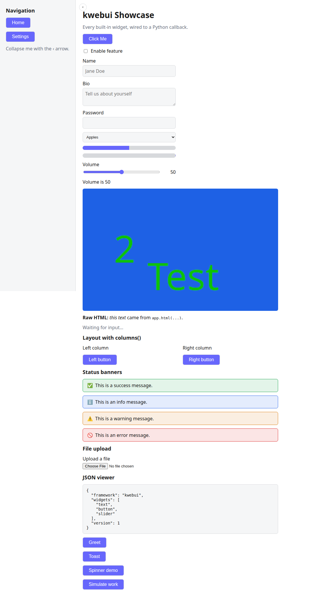

# kwebui

[](LICENSE)
[](https://www.python.org/downloads/)
[](#contributing)

**Build web UIs in pure Python — no HTML, CSS, or JavaScript required.**

kwebui is a clean, plugin-oriented alternative to Streamlit: every widget is a
self-contained plugin, the core framework knows nothing about individual
widgets, and the whole thing is small enough to read in an afternoon (see
[`docs/architecture.md`](docs/architecture.md)). A **retained tree** of
widgets lives server-side; mutating one pushes a single, minimal JSON patch
over a WebSocket to every connected browser — no full-page reruns, no
diffing a virtual DOM on every keystroke.

```python
from kwebui import KApp

class Demo(KApp):
    def build(self):
        self.text("Hello World", size=28)
        self.button("Click Me", on_click=lambda: print("Clicked"))

Demo(title="Demo").run()
```



## Table of contents

- [Why kwebui](#why-kwebui)
- [Installation](#installation)
- [Quickstart](#quickstart)
- [User guide](#user-guide)
- [Widgets](#widgets)
- [Themes](#themes)
- [Packaging / installing elsewhere](#packaging--installing-elsewhere)
- [Project layout](#project-layout)
- [Session model — please read before production use](#session-model)
- [Contributing](#contributing)
- [License](#license)

## Why kwebui

- **Pure Python.** No HTML/CSS/JS to write, no separate frontend build step,
  no Node.js/npm involved anywhere — `pip install -e .` is enough.
- **Plugin-oriented core.** Every widget (`text`, `button`, `table`,
  `container`, ...) is a self-contained plugin under `kwebui/widgets/`,
  auto-discovered at startup. Delete every file under `widgets/` and `KApp`
  still imports and runs — the core genuinely has no special knowledge of
  any individual widget type.
- **Retained tree, not rerun-the-script.** Widgets are live Python objects
  you mutate directly (`widget.set_text(...)`, `widget.update(...)`) — not
  something you recreate on every interaction. Each mutation ships exactly
  one minimal patch to connected browsers.
- **Small enough to actually read.** The core (`app.py`, `widget.py`,
  `plugin.py`, `renderer.py`, `registry.py`) is a few hundred lines total.
  See [`docs/architecture.md`](docs/architecture.md).
- **No CDN, no build tools.** The frontend is Vue 3, vendored as a single
  `vue.global.js` file and loaded directly — components are plain JS
  objects with template strings, not `.vue` Single File Components.

## Installation

Requires Python 3.12+.

```bash
python3.12 -m venv .venv
source .venv/bin/activate        # Windows: .venv\Scripts\activate
pip install -e .                 # add [dev] for tests, [imagestream] for OpenCV demos, [file_uploader] for uploads
```

Or straight from GitHub, no local clone needed:

```bash
pip install "git+https://github.com/Kaptura-GmbH/kwebui.git"
```

See [`docs/user-guide.md`](docs/user-guide.md#1-install-kwebui-as-a-package)
for every install path (editable, from git, or as a built wheel).

## Quickstart

```bash
python examples/demo.py          # the snippet above
python examples/showcase.py      # every built-in widget on one page
python examples/workflow.py      # topbar + workflow_tracker driving which page a container() shows
python examples/custom_theme.py  # a theme CSS file shipped from your own project, not the kwebui package
python examples/mjpeg_demo.py    # live MJPEG stream + snapshot capture (needs [imagestream])
python examples/daheng_demo.py   # Daheng camera picker + live config (needs gxipy, see its docstring)
```

Open the printed URL (default `http://127.0.0.1:8701`, or the next free
port after it if 8701 is already taken) in a browser.

## User guide

See [`docs/user-guide.md`](docs/user-guide.md) for the full walkthrough
with a real screenshot for every widget. The short version:

1. Subclass `KApp` and override `build()` to construct the page **once**
   by calling widget methods on `self` (`self.text(...)`, `self.button(...)`,
   ...) — `build()` runs automatically when you instantiate the class.
   Then call `MyApp(title="...").run()`.
2. Every widget method returns a live widget object. Store it on `self`
   to change it later — from a callback, a background thread, or
   anywhere else — and the browser updates automatically, without a
   full page reload:

   ```python
   class Demo(KApp):
       def build(self):
           self.greeting = self.text("Hello")
           self.button("Again", on_click=self.say_again)

       def say_again(self):
           self.greeting.set_text("Hello again")   # pushes a minimal patch to every browser
   ```
3. Callbacks (`on_click`, `on_change`, ...) are plain Python functions
   that run on the server, each on its own worker thread — the browser
   only ever sends events, so a blocking callback never freezes the UI
   for other connected browsers.
4. Advanced: inside a callback, `self.session` gives you the connection
   that triggered it (`self.session.state` is a free scratchpad dict).
   Most apps never need this.

## Widgets

For the full, illustrated version of this table — a real screenshot for
every widget, plus the install-and-run walkthrough in more depth — see
[`docs/user-guide.md`](docs/user-guide.md).

| Widget | Example (inside `build()`, called on `self`) |
|---|---|
| Text | `self.text("Hi", size=24, color="red", bold=True, italic=False, align="left")` |
| Button | `self.button("Save", on_click=save, enabled=True, shortkey="ctrl+k", color="red", text_color="white")` — `shortkey` binds a keyboard combo (`"k"`, `"shift+k"`, `"ctrl+k"`, `"shift+ctrl+k"`) that calls `on_click`, but only while the button is visible and enabled; `color`/`text_color` accept any CSS color and default to the theme's `--sg-button-bg`/`--sg-button-text-color` variables (an explicit value overrides just that button) |
| Checkbox | `self.checkbox("Enable feature", checked=False, on_change=lambda v: ...)` |
| TextEdit | `self.textedit("Name", placeholder="Jane", multiline=False, password=False, on_change=lambda v: ..., on_enter=lambda v: ...)` |
| Slider | `self.slider("Volume", min_value=0, max_value=100, value=50, on_change=lambda v: ...)` |
| ListBox | `self.listbox(["A", "B", "C"], on_select=lambda item: ...)` |
| ProgressBar | `self.progressbar(50)` / `self.progressbar(0, indeterminate=True)` |
| Spinner | `with self.spinner("Working...", show_time=True): do_slow_thing()` |
| Image | `self.image("cat.jpg", width=150)` / `self.image("cat.jpg", stretch=True)` — `width` (-1/0 = natural size, default) resizes the viewer; `stretch=True` fills the parent container's width instead. Local paths and URLs both work |
| ImageStream | `self.imagestream(frame_provider=capture_jpeg, fps=15)` — live MJPEG feed (webcam/OpenCV); or call `stream.push_frame(jpeg_bytes)` yourself. Same `width`/`stretch` as Image. `stream.latest_frame()` returns the most recent JPEG bytes (see `examples/mjpeg_demo.py` for a snapshot-capture button) |
| FileUploader | `self.file_uploader("Upload a file", accept=".csv", on_upload=lambda filename, data: ...)` — needs the `[file_uploader]` extra installed; without it, uploads return a clear error instead of failing |
| Html | `self.html("<strong>Raw HTML</strong>")` — trusts the string, don't pass unsanitized user input |
| Json | `self.json({"status": "ok", "items": [1, 2, 3]})` — pretty-printed, read-only |
| Table | `self.table([{"name": "Alice", "age": 30}], width=-1, stretch=False, border=True, hide_header=False)` — read-only dataframe-style grid; also accepts a dict of columns, a list of lists + `columns=...`, or a real `pandas.DataFrame` (detected by shape, no pandas dependency added) |
| Empty | `slot = self.empty(); slot.text("Loading..."); slot.progressbar(80)` — a placeholder whose content can be swapped in place |
| Container | `page = self.container(width=300, height=-1, stretch=False, border=True, border_roundness=True, caption="Settings", direction="vertical", wrap=False, horizontal_alignment=None, vertical_alignment=None, shortkey=None, on_keypress=None, vertical_padding=None, horizontal_padding=None); page.text("Hi"); page.button("Go"); ...; page.clear()` — like `Empty`, but holds a whole group of widgets instead of one; `.clear()` wipes it before rebuilding with different content. `direction="horizontal"` lines children up side by side (each at its own natural size) instead of stacked — unlike `columns(n)`'s fixed-width slots — and `wrap=True` lets them flow onto further lines once a row no longer fits, e.g. a row of `Badge`s. `horizontal_alignment`/`vertical_alignment` (`"left"/"center"/"right"` and `"top"/"center"/"bottom"`) position children within a fixed `width`/`height`, e.g. a "panel" with a centered button — their meaning stays tied to the horizontal/vertical axis regardless of `direction`. `shortkey` works like Button's, but calls `on_keypress` (there's no `on_click` to reuse) and only fires while the container is visible. `vertical_padding`/`horizontal_padding` (px) default to the theme's `--sg-container-padding-vertical`/`--sg-container-padding-horizontal` variables (`10px` each); an explicit value (including `0`) overrides just that container |
| Success / Info / Warning / Error | `self.success("Saved!")`, `self.info(...)`, `self.warning(...)`, `self.error(...)` — colored status banners |
| Badge | `self.badge("New")` / `self.badge("Active", icon="✅", color="success")` — a small pill-shaped status/tag label; `color` is `success`/`info`/`warning`/`error` (same colors as the banners above) or `None` for neutral |
| Toast | `self.toast("Saved!", level="success")` — a transient corner notification |
| Columns | `left, right = self.columns(2)` — side-by-side containers, each accepting the same widget calls as `self`; or `narrow, wide = self.columns([0.3, 0.7])` for relative widths (weights must be positive and sum to 1) |
| Sidebar | `nav = self.sidebar()` — a persistent panel pinned to the left edge, collapsible by default |
| Popup | `self.popup("Discard changes?", kind="yesno", on_return=lambda answer: ...)` — a modal dialog; `kind` is `ok`, `okcancel`, `yesno`, or `yesnocancel` |
| WorkflowTracker | `self.workflow_tracker(tasks, orientation="horizontal", on_select=lambda task_id: ...)` — a step tracker; each task is `{"id", "title", "status", "detail"}` |
| Topbar | `bar = self.topbar(); bar.workflow_tracker(tasks)` — a full-width panel pinned to the top of the page, sticky by default |

Every widget returned by `self.<widget>(...)` has an `.update(**props)`
method plus typed setters (e.g. `text.set_text(...)`, `checkbox.set_checked(...)`).
Every widget also has, regardless of type:

```python
self.name.highlight()          # outline in the theme's default color (red)
self.name.highlight("#16a34a") # or a specific color, for this widget only
self.name.unhighlight()

self.name.focus()              # send keyboard focus to it

self.name.hide()                # visually hide it (stays in the tree, keeps its state)
self.name.show()                # reveal it again
self.name.remove()              # drop it from the page and server memory for good
```

## Themes

```python
self.set_theme("dark")   # or "light" (default)
```

Themes are plain CSS files. The bundled ones live in `kwebui/themes/` —
add a third by dropping a `themes/<name>.css` file there defining the
same `--sg-*` custom properties as `light.css`/`dark.css`. `--sg-highlight`
is the default color `.highlight()` uses when called without an explicit
color.

`set_theme()` also accepts a path to a CSS file anywhere in your own
project, not bundled with kwebui at all — `self.set_theme("assets/brand.css")`.
Its name becomes that file's own stem (`brand.css` → `"brand"`); pass
that name again later to switch back to it. See
[`docs/user-guide.md`](docs/user-guide.md#8-themes) for the full
behavior (when it takes effect, live reload from disk, ...) and
`examples/custom_theme.py` for a runnable example.

Some `--sg-*` variables are structural defaults rather than
theme-specific colors — `--sg-button-bg`/`--sg-button-text-color`
(`button`'s `color`/`text_color` defaults) and
`--sg-container-padding-vertical`/`--sg-container-padding-horizontal`
(`container`'s padding defaults, `10px` each) live once in `base.css`'s
`:root` and apply across every theme. Override them in a custom
stylesheet to change the default everywhere at once, or pass the
matching widget parameter to override just one instance.

## Packaging / installing elsewhere

This is a standard `pyproject.toml` package, so any of these work:

```bash
# Editable install for local development (what the steps above do)
pip install -e .

# Build a distributable wheel + sdist
pip install build
python -m build                                  # writes dist/kwebui-<version>-py3-none-any.whl
pip install dist/kwebui-<version>-py3-none-any.whl   # on any machine with that wheel

# Install straight from this repository (no PyPI needed)
pip install "git+https://github.com/Kaptura-GmbH/kwebui.git"
```

To embed kwebui in another app: `pip install` it into that app's own
venv the same way, then `from kwebui import KApp` as usual — there is
no separate "export" step, the package *is* the deliverable.

## Project layout

See [`docs/architecture.md`](docs/architecture.md) for the plugin system,
rendering pipeline, event flow, and session model, and
[`docs/class-diagram.md`](docs/class-diagram.md) for a Mermaid class
diagram of the core framework and every built-in widget plugin.

The frontend (`kwebui/frontend/static/`) is Vue 3, loaded as a single
`vue.global.js` file (vendored under `static/js/vendor/`, no CDN) rather
than Single File Components — this keeps `pip install -e .` free of any
Node.js/npm involvement, at the cost of writing components as plain JS
objects with template strings instead of `.vue` files. Each widget type
is still its own file under `frontend/static/js/widgets/`, auto-discovered
and injected as a `<script>` tag the same way the Python side auto-discovers
plugins.

## Session model

> [!IMPORTANT]
> All browsers connected to a running app share the *same* live widget
> tree — this is a broadcast/dashboard model (like a kiosk or control
> panel), **not** Streamlit's per-tab isolated state. Great for "one
> screen, several viewers" — control panels, dashboards, kiosks; not
> meant for multi-tenant apps where each visitor should see their own
> private data.

This is a deliberate simplification, not an oversight: true per-session
isolation would mean cloning the widget tree per connection and
re-binding every callback closure to the clone, which is a lot of
machinery for a library meant to be readable in an afternoon. `Session`
is still its own class internally, so per-session isolation could be
added later without an API break — see
[`docs/architecture.md`](docs/architecture.md#5-sessions) for the
reasoning in full.

## Contributing

Issues and pull requests are welcome. Before opening a PR:

1. For anything touching rendering, layout, or an interactive round-trip
   (click → server → browser), verify it in a real browser — several
   real bugs in this codebase's history were invisible in a code read and
   obvious in a screenshot.
2. Keep changes scoped: a bug fix doesn't need surrounding refactors, and
   a new widget should follow the existing plugin pattern (see
   [`docs/architecture.md`](docs/architecture.md) and any existing
   `kwebui/widgets/*.py` file as a template).

## License

Apache License 2.0. See [LICENSE](LICENSE).
