# User Guide: Build & Run Your Own kwebui App

This is for someone who wants to **use** kwebui to build a web UI — not
someone hacking on kwebui itself. If you're looking for how the framework
is put together internally, see [architecture.md](architecture.md) and
[class-diagram.md](class-diagram.md) instead.

The whole workflow is three steps: **install** kwebui as a package,
**write** a small Python file that subclasses `KApp`, **run** that file.
No HTML, CSS, or JavaScript required, and no separate frontend build step
— the UI is generated from the Python widget calls you make, and Vue (the
one frontend dependency) ships vendored inside the package.

Every widget in this guide is a real screenshot of a running app — the
same `examples/showcase.py` that ships in the repo:


## Requirements

- Python 3.12 or newer.
- Network access to install the package (once) and its dependencies.

## 1. Install kwebui as a package

Pick whichever of these fits how you got the code.

### From a local clone, into your own project's environment

If you already have this repository checked out (e.g. at
`/path/to/kwebui`), install it into the virtual environment of the
project where you want to *use* it — not necessarily the repo's own
`.venv`:

```bash
cd /path/to/your-own-project
python3.12 -m venv .venv
source .venv/bin/activate            # Windows: .venv\Scripts\activate
pip install /path/to/kwebui
```

Add `-e` (`pip install -e /path/to/kwebui`) if you want changes to the
kwebui source to take effect immediately without reinstalling — useful
while you're still developing against it, not required otherwise.

### Directly from GitHub

No local clone needed — pip can install straight from git:

```bash
pip install "git+https://github.com/Kaptura-GmbH/kwebui.git"
```

Pin to a specific tag, branch, or commit so your app doesn't silently
pick up unreviewed changes later:

```bash
pip install "git+https://github.com/Kaptura-GmbH/kwebui.git@0.10.3"
```

Using SSH instead of HTTPS works the same way if you have SSH keys set
up for GitHub:

```bash
pip install "git+ssh://git@github.com/Kaptura-GmbH/kwebui.git"
```

### As a wheel (for offline installs or sharing with a teammate)

Build once from a checkout:

```bash
cd /path/to/kwebui
python3.12 -m pip install build
python3.12 -m build          # writes dist/kwebui-<version>-py3-none-any.whl
```

Then install the wheel anywhere, no network or git access needed:

```bash
pip install /path/to/kwebui/dist/kwebui-*-py3-none-any.whl
```

### Verify it worked

```bash
python -c "import kwebui; print(kwebui.__version__)"
```

## 2. Write your app

Create a plain Python file anywhere in your own project — it does not
need to live inside the kwebui repository:

```python
# my_app.py
from kwebui import KApp

class MyApp(KApp):
    def build(self) -> None:
        self.text("Hello, kwebui!", size=28, bold=True)
        self.button("Click Me", on_click=lambda: print("Clicked"))

if __name__ == "__main__":
    MyApp(title="My App").run()
```

Two rules that cover almost every app:

1. **Subclass `KApp` and override `build()`.** `build()` runs exactly
   once, right when you instantiate your class, and its job is to call
   widget methods on `self` (`self.text(...)`, `self.button(...)`, ...)
   to construct the page. Every such call both creates the widget *and*
   adds it to the page — there's no separate "add it to the layout" step.
2. **Store the return value if you need to change a widget later.** Every
   widget method returns a live widget object:

   ```python
   class MyApp(KApp):
       def build(self) -> None:
           self.greeting = self.text("Hello")
           self.button("Say it again", on_click=self.say_again)

       def say_again(self) -> None:
           self.greeting.set_text("Hello again!")
   ```

   `set_text(...)` (and the other typed setters — `set_value`,
   `set_checked`, `set_items`, ...) patch just that widget in every
   connected browser, without a page reload. `widget.update(**props)` is
   the untyped equivalent if a widget doesn't have a dedicated setter for
   the property you want to change.

Callbacks (`on_click`, `on_change`, `on_select`, `on_upload`, ...) are
plain Python functions or methods that run on the server; the browser
only ever sends an event and waits for the resulting UI patch. Each
callback runs on its own worker thread, so it's safe to block inside one
— `time.sleep(...)`, a camera read, a slow API call — without freezing
the UI for other connected browsers.

## 3. Run it

```bash
python my_app.py
```

```
kwebui app running on http://127.0.0.1:8701 (Press CTRL+C to quit)
```

Open that URL in a browser. If port 8701 is already taken, `run()` tries
8702, 8703, ... automatically and prints whichever port it actually
bound — the printed line is always the source of truth, don't hardcode
the port. Override the default explicitly if you want:

```python
MyApp(title="My App").run(host="0.0.0.0", port=9000)
```

`host="0.0.0.0"` makes the app reachable from other machines on your
network, not just `127.0.0.1`.

The main content column's width is also configurable, via `width=` on the
`KApp` constructor itself (not `run()`) — a page-load-time setting in CSS
pixels, separate from any individual widget's own `width`/`stretch`:

```python
MyApp(title="My App", width=1000).run()
```

Leave it out and the page keeps its original fixed 720px-wide column.

**One important thing to know before you rely on it in production:** all
browsers connected to a running app share the *same* live widget tree —
this is a broadcast/dashboard model (like a kiosk or control panel), not
Streamlit's per-tab isolated state. Great for "one screen, several
viewers"; not meant for multi-tenant apps where each visitor should see
their own private data. It's a deliberate simplification, not an
oversight: true per-session isolation would mean cloning the tree per
connection and re-binding every callback closure to the clone, which is
a lot of machinery for a library meant to be readable in an afternoon.
`Session` is still its own class, so per-session isolation could be
added later without breaking the API.

## 4. Widget catalog

Every widget is called as `self.<name>(...)` inside `build()` (or on a
container returned by `columns()`/`sidebar()`, which support the same
calls — see [Layout](#layout-columns-and-sidebar) below). Every widget
returned by `self.<widget>(...)` also has an `.update(**props)` method
plus typed setters where it makes sense (e.g. `text.set_text(...)`,
`checkbox.set_checked(...)`, `slider.set_value(...)`) — call these later,
from a callback, to change what's on screen without a page reload. Every
widget also has `.highlight()`/`.unhighlight()` (see
[Highlighting a widget](#highlighting-a-widget) below), `.focus()`
(see [Sending keyboard focus](#sending-keyboard-focus) below), and
`.hide()`/`.show()`/`.remove()`/`.enable()`/`.disable()` (see
[Hiding, showing, removing, and disabling a widget](#hiding-showing-removing-and-disabling-a-widget)
below), regardless of type.

Quick reference, then a screenshot for each one below:

| Widget | Call |
|---|---|
| [Text](#text) | `self.text("Hi", size=24, color="red", bold=True, italic=False, align="left")` |
| [Button](#button) | `self.button("Save", on_click=save, enabled=True, shortkey=None, color=None, text_color=None)` |
| [Checkbox](#checkbox) | `self.checkbox("Enable feature", checked=False, on_change=lambda v: ...)` |
| [TextEdit](#textedit) | `self.textedit("Name", value="", placeholder="Jane", multiline=False, password=False, on_change=lambda v: ..., on_enter=lambda v: ...)` |
| [Slider](#slider) | `self.slider("Volume", min_value=0, max_value=100, value=50, step=1, on_change=lambda v: ...)` |
| [ListBox](#listbox) | `self.listbox(["A", "B", "C"], selected_index=None, on_select=lambda item: ...)` |
| [ProgressBar](#progressbar) | `self.progressbar(50)` / `self.progressbar(0, indeterminate=True)` |
| [Spinner](#spinner) | `with self.spinner("Working...", show_time=True): do_slow_thing()` |
| [Image](#image) | `self.image("cat.jpg", width=-1, stretch=False)` |
| [ImageStream](#imagestream) | `self.imagestream(frame_provider=capture_jpeg, fps=15, width=-1, stretch=False)` |
| [FileUploader](#fileuploader) | `self.file_uploader("Upload a CSV", accept=".csv", on_upload=lambda filename, data: ...)` |
| [Html](#html) | `self.html("<strong>Raw HTML</strong>")` |
| [Json](#json) | `self.json({"status": "ok", "items": [1, 2, 3]})` |
| [Table](#table) | `self.table([{"name": "Alice", "age": 30}], width=-1, stretch=False, border=True, hide_header=False)` |
| [Empty](#empty) | `slot = self.empty(); slot.text("Loading...")` |
| [Container](#container) | `page = self.container(width=-1, height=-1, stretch=False, border=True, border_roundness=True, caption="", direction="vertical", wrap=False, horizontal_alignment=None, vertical_alignment=None, shortkey=None, on_keypress=None, vertical_padding=None, horizontal_padding=None); page.text("Hi"); page.clear()` |
| [Alerts: success, info, warning, error](#alerts-success-info-warning-error) | `self.success("Saved!")`, `self.info(...)`, `self.warning(...)`, `self.error(...)` |
| [Badge](#badge) | `self.badge("New")` / `self.badge("Active", icon="✅", color="success")` |
| [Toast](#toast) | `self.toast("Saved!", level="success", duration_ms=4000)` |
| [Columns](#layout-columns-and-sidebar) | `left, right = self.columns(2)` or `narrow, wide = self.columns([0.3, 0.7])` |
| [Sidebar](#layout-columns-and-sidebar) | `nav = self.sidebar()` / `self.sidebar(collapsible=False)` |
| [Popup](#popup) | `self.popup("Discard changes?", kind="yesno", on_return=lambda answer: ...)` |
| [WorkflowTracker](#workflowtracker) | `self.workflow_tracker(tasks, orientation="horizontal", on_select=lambda task_id: ...)` |
| [Topbar](#topbar) | `bar = self.topbar(); bar.workflow_tracker(tasks)` |

### Text

```python
self.text("kwebui Showcase", size=28, bold=True)
```

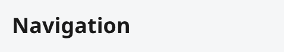

### Button

```python
self.button("Click Me", on_click=lambda: print("Clicked"))
```

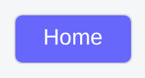

```python
self.button("Search", on_click=open_search, shortkey="ctrl+k")
```

`shortkey` binds a keyboard combo — `"k"`, `"shift+k"`, `"ctrl+k"`,
`"shift+ctrl+k"` (modifiers in any order, joined with `+`) — that calls
`on_click` exactly as if the button had been clicked. It's a global
browser listener, but only fires while *this* button is actually visible
on the page: not `.hide()`-den, not inside a hidden container/sidebar/
etc. (a hidden ancestor hides everything inside it, same as it does
visually), and not disabled — a disabled button's shortkey is as inert
as its click would be. A bare or shift-only combo (`"k"`, `"shift+k"`)
is additionally suppressed while focus is in a text input, textarea, or
contenteditable element, so it can't hijack normal typing; a combo that
also holds ctrl/alt/meta still fires even while typing, matching the
usual convention for something like a "Ctrl+K" command shortcut. Change
it later with `button.set_shortkey(...)` (`None` to remove it).

```python
self.button("Delete", on_click=delete_item, color="red", text_color="white")
```

`color` sets the button's background; `text_color` sets its text. Both
default to `None`, meaning "use the theme's own default" —
`--sg-button-bg`/`--sg-button-text-color` in `base.css`, which themselves
default to the theme's `--sg-accent`/`--sg-accent-fg` (exactly the
original rendering, unchanged). Restyle those two variables in a custom
stylesheet to change every button's default color at once, without
touching `--sg-accent` (which sliders and other accent-colored widgets
also use); pass `color`/`text_color` to override just one button
instance. Either accepts any valid CSS color: a name (`"red"`,
`"purple"`, `"blue"`, ...), a hex code (`"#16a34a"`), `"rgb(...)"`, etc.
— passed straight through to the browser with no validation on kwebui's
side, so an invalid value is just ignored by the browser (falls back to
the theme color) rather than raising an error. Change either later with
`button.set_color(...)` / `.set_text_color(...)`.

### Checkbox

```python
self.checkbox("Enable feature", on_change=lambda checked: print("checkbox:", checked))
```

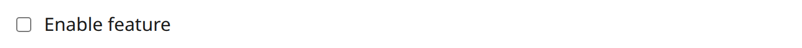

### TextEdit

```python
self.name = self.textedit("Name", placeholder="Jane Doe")
self.textedit("Bio", multiline=True, placeholder="Tell us about yourself")
self.textedit("Password", password=True)
self.textedit("Device ID", on_enter=lambda v: check_inventory(v))
```

`multiline=True` swaps the `<input>` for a `<textarea>`; `password=True`
masks input. Read the current value any time via `self.name.value`.
`on_change` fires on every keystroke; `on_enter` fires once, only when
the user presses Enter in a single-line field (not available on
`multiline=True`, where Enter inserts a newline instead).

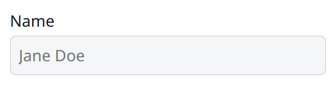

### Slider

```python
self.volume = self.slider("Volume", min_value=0, max_value=100, value=50, on_change=self.on_volume)
```

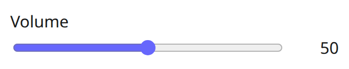

### ListBox

```python
self.listbox(["Apples", "Bananas", "Cherries"], on_select=lambda item: print("selected:", item))
```

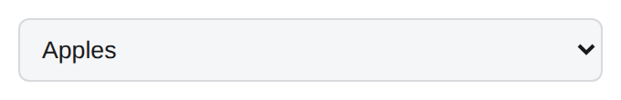

### ProgressBar

```python
self.progress = self.progressbar(50)
self.progressbar(0, indeterminate=True)   # animated, no known percentage
```

`self.progress.set_value(75)` updates it later. The registry name
`progress` is also accepted as a shorthand alias for `progressbar`.

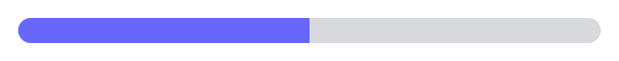

### Spinner

```python
with self.spinner("Working...", show_time=True):
    do_slow_thing()   # safe to block -- callbacks run off the event loop
```

`show_time=True` ticks an elapsed-seconds counter next to the spinner
text while the block runs. The widget never leaves the page; `__exit__`
just hides it again, so it's reusable across multiple `with` blocks.

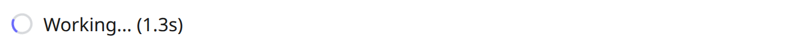

### Image

```python
self.image(str(ASSET))                  # local path or a URL both work
self.image(str(ASSET), width=150)       # resize the viewer to 150px wide
self.image(str(ASSET), stretch=True)    # fill the parent container's width
```

`width` defaults to `-1` (the image's own size); `-1` or `0` both mean
that, and any value above `0` resizes the viewer to that many pixels
wide (height follows the image's aspect ratio). `stretch=True` fills
the parent container's width instead and takes priority over `width`.
Change either later with `image.set_width(...)` / `image.set_stretch(...)`.


### ImageStream

```python
self.imagestream(frame_provider=capture_jpeg_from_camera, fps=15)
# or push frames yourself, e.g. from a background thread reading a webcam:
# stream = self.imagestream()
# stream.push_frame(jpeg_bytes)
```

A live MJPEG feed — `frame_provider` is a zero-argument callable
returning JPEG bytes, polled at `fps` on your behalf. `stream.set_fps(0)`
switches to unthrottled (max speed) at any time. `width` and `stretch`
work exactly like [Image](#image)'s: `-1`/`0` (the default) shows the
stream at its own frame size, anything above `0` resizes the viewer,
and `stretch=True` fills the parent container's width (taking priority
over `width`); change either later with `stream.set_width(...)` /
`stream.set_stretch(...)`. See
`examples/mjpeg_demo.py` and `examples/daheng_demo.py` for real
camera-backed uses.

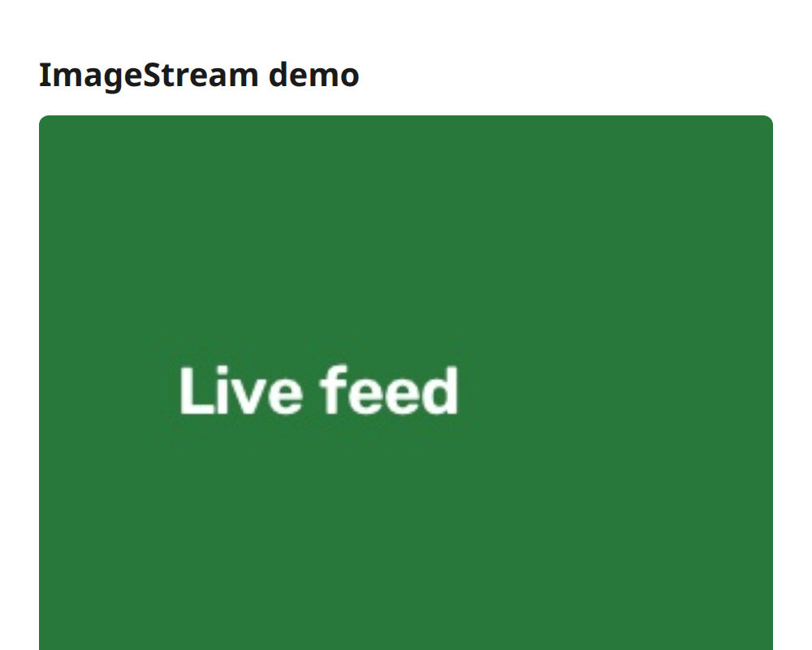

### FileUploader

```python
self.file_uploader("Upload a file", on_upload=self.on_upload)

def on_upload(self, filename: str, data: bytes) -> None:
    print(f"uploaded {filename} ({len(data)} bytes)")
```

`accept` restricts the file picker (e.g. `accept=".csv"`), `multiple=True`
allows more than one file per upload. `on_upload` fires once per file.

Uploads are parsed with the optional `python-multipart` package, which is
not installed by the base `pip install kwebui` — install it with
`pip install kwebui[file_uploader]`. Without it, the widget still renders
normally; attempting an upload just returns a clear error telling you to
install the extra, instead of failing deep inside the web framework.

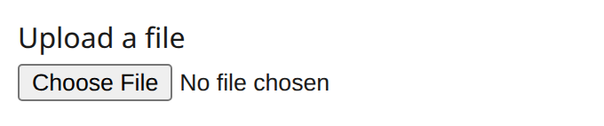

### Html

```python
self.html("<strong>Raw HTML:</strong> <em>this text</em> came from <code>app.html(...)</code>.")
```

Written to the page as-is (`innerHTML`, not escaped text) — like
Streamlit's `st.html`, this trusts the string. Only pass content you
wrote yourself, never unsanitized user input.

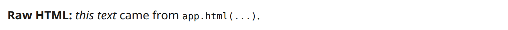

### Json

```python
self.json({"framework": "kwebui", "widgets": ["text", "button", "slider"], "version": 1})
```

Pretty-printed and read-only; pass any JSON-serializable Python value.

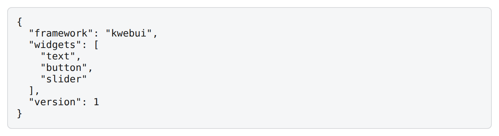

### Table

```python
self.table([
    {"name": "Alice", "role": "Engineer", "age": 30},
    {"name": "Bob", "role": "Designer", "age": 25},
])
```

A read-only, dataframe-style grid. `data` accepts several shapes — no
pandas dependency required for any of them:

```python
self.table([{"name": "Alice", "age": 30}, {"name": "Bob", "age": 25}])   # list of row dicts
self.table({"name": ["Alice", "Bob"], "age": [30, 25]})                  # dict of columns
self.table([[30, "Alice"], [25, "Bob"]], columns=["age", "name"])        # list of rows + explicit columns
self.table(some_dataframe)                                               # a real pandas.DataFrame also works
```

Column headers come from the first row dict's keys, the column-dict's
keys, or the explicit `columns` argument (required for a plain list of
lists/tuples — otherwise columns just number `0`, `1`, ...). A real
`pandas.DataFrame` is accepted too — detected by shape (`.columns` +
`.values`), not by importing pandas, so kwebui itself never depends on
it. Missing keys/`None` cells render as an empty cell.

`width` and `stretch` work exactly like [Image](#image)'s: `width`
defaults to `-1` (sized to its own content), any value above `0` resizes
the table to that many pixels wide, and `stretch=True` fills the parent
container's width instead and takes priority over `width`. `border`
(default `True`) draws a border around the table and between every
cell — its color and thickness are the `--sg-table-border-color`/
`--sg-table-border-width` CSS variables (`base.css`), overridable
without touching any other widget's border. The header row always
renders shaded (the same `--sg-input-bg` theme variable used for
sidebar/input backgrounds) regardless of `border`; `hide_header=True`
removes the header row entirely. Change any of these later with
`table.set_data(...)` / `.set_width(...)` / `.set_stretch(...)` /
`.set_border(...)` / `.set_hide_header(...)`.

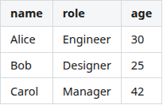

### Empty

```python
self.status = self.empty()
self.status.text("Waiting for input...", color="#6b7280")
# later, from a callback:
self.status.text("Done!", color="#2563eb")   # replaces the previous content
```

A placeholder slot whose single child can be swapped out in place —
equivalent to Streamlit's `st.empty()`.

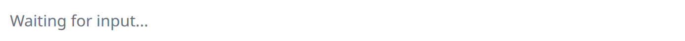

### Container

```python
self.content = self.container()
self.content.text("Page 1", size=20, bold=True)
self.content.button("Next", on_click=go_to_page_2)

# later, from a callback -- wipe it and rebuild with different content:
self.content.clear()
self.content.text("Page 2", size=20, bold=True)
```

Like `Empty`, but holds a whole *group* of widgets instead of a single
one — useful for swapping between several unrelated "pages" of widgets
while the app keeps running. `clear()` removes everything currently
inside it; call it before rebuilding with different content. See
`examples/workflow.py` for a full example: a `workflow_tracker` in a
`topbar` whose selected step decides what a `container()` shows below it.

```python
self.container(width=300)        # fixed-width box, sized to that width
self.container(height=200)       # fixed-height box, sized to that height
self.container(stretch=True)     # fills the parent container's width
self.container(border=False)     # no border
self.container(border_roundness=False)  # square corners instead of rounded
```

`width` and `stretch` work exactly like [Image](#image)'s: `width`
defaults to `-1` (sized to its own content), any value above `0` resizes
the box to that many pixels wide, and `stretch=True` fills the parent
container's width instead and takes priority over `width`. `height`
follows the same `-1`-means-natural-size convention as `width`, but has
no `stretch` equivalent — there's no way to make a container fill its
parent's *height*, only give it an explicit one. Change it later with
`container.set_height(...)`. `border`
(default `True`) draws a border around the container; `border_roundness`
(default `True`) rounds its corners. Change any of these later with
`container.set_width(...)` / `.set_stretch(...)` / `.set_border(...)` /
`.set_border_roundness(...)`. The border's color/width and the corner
radius come from the `--sg-container-border-color`,
`--sg-container-border-width`, and `--sg-container-border-radius` CSS
variables (`base.css`), so a custom stylesheet can restyle them without
touching any other widget's border.

```python
self.container(caption="Settings")   # caption breaks the top border line
```

`caption` (default `""`, no caption) renders on the container's own top
border line — like an HTML `<fieldset>`/`<legend>`, which is exactly
what a container is under the hood, so the effect is free rather than a
custom overlay. With `border=False` there's no line to break, so the
caption just sits above the content as a plain label. Change it later
with `container.set_caption(...)`.

```python
row = self.container(direction="horizontal")
row.text("test1")
row.text("test2")   # side by side instead of stacked

flow = self.container(direction="horizontal", wrap=True, width=260)
for label in ("New", "Beta", "Active", "Deprecated", "Failed"):
    flow.badge(label)   # wraps onto further lines once a row no longer fits
```

`direction` (`"vertical"`, the default, or `"horizontal"`) is the axis
children are laid out on. This gives a flexible "row" distinct from
[Columns](#layout-columns-and-sidebar): `columns(n)` divides the row into
`n` fixed-width slots regardless of what's inside each one, while a
horizontal `container()` sizes each child to its own natural size and
only wraps (with `wrap=True`) once a row no longer fits — a natural fit
for a row of [Badge](#badge)s or short buttons, not a page grid.
`wrap` (default `False`) is only meaningful combined with
`direction="horizontal"`; left `False`, children that don't fit on one
line either overflow (scrollable — see the note below) or get squeezed,
same as any ordinary flex row. Change either later with
`container.set_direction(...)` / `.set_wrap(...)`; an invalid `direction`
raises `ValueError` immediately. `horizontal_alignment`/
`vertical_alignment` (below) keep working the same way regardless of
`direction` — see the note under them.

```python
box = self.container(width=500, horizontal_alignment="center")
box.button("Centered button")

self.container(horizontal_alignment="right")   # pack children against the right edge
self.container(vertical_alignment="bottom")    # pack children against the bottom edge

# A fixed-height "panel" with its content centered both ways:
panel = self.container(width=400, height=200, horizontal_alignment="center", vertical_alignment="center")
panel.button("Centered")
```

`horizontal_alignment` (`"left"`/`"center"`/`"right"`) and
`vertical_alignment` (`"top"`/`"center"`/`"bottom"`) position children
within the container's own box, once that box is actually bigger than
its content — a `width` wider than what's inside for `horizontal_alignment`,
or an explicit `height` taller than what's inside for `vertical_alignment`
(a container's height is otherwise sized to its content, so
`vertical_alignment` alone does nothing — pair it with `height` to get a
"panel" that centers/bottom-aligns its content). Both default to `None`, which
means "don't touch this at all" rather than `"left"`/`"top"` — every
child keeps stretching to the container's full width and packing at the
top exactly as before these two parameters existed. Picking an explicit
`horizontal_alignment` shrinks every child to its own natural size first
and *then* aligns it, so a `listbox`/`textedit`/`slider`/alert
(`success()`/`info()`/`warning()`/`error()`) inside an aligned container
renders narrower than in a plain one — that's a real trade-off, not a
bug, so reach for an explicit alignment only where you actually want that
shrink-then-align look. Change either later with
`container.set_horizontal_alignment(...)` / `.set_vertical_alignment(...)`
(pass `None` to go back to the default).

`horizontal_alignment`/`vertical_alignment` keep their *meaning*
regardless of `direction` — `horizontal_alignment` always positions
children along the horizontal axis, `vertical_alignment` always along
the vertical one, whether `direction` is `"vertical"` or `"horizontal"`.

```python
app.container(shortkey="ctrl+j", on_keypress=open_command_palette)
```

`shortkey` works exactly like [Button](#button)'s: a keyboard combo
(`"k"`, `"shift+k"`, `"ctrl+k"`, `"shift+ctrl+k"`) that only fires while
this container is actually visible, with the same typing-field
suppression for bare/shift-only combos. The difference is what it calls
— a container has no `on_click` to reuse, so `shortkey` here calls the
dedicated `on_keypress` callback instead. Change either later with
`container.set_shortkey(...)` / `.set_on_keypress(...)`.

```python
app.container(vertical_padding=16, horizontal_padding=24).text("Breathing room")
```

`vertical_padding`/`horizontal_padding` (in px) add space between the
container's own edge and its content — top/bottom and left/right
respectively. Both default to `None`, meaning "use the theme's own
default" — `--sg-container-padding-vertical`/
`--sg-container-padding-horizontal` in `base.css`, `10px` each out of
the box. Restyle those variables to change every container's default
padding at once, or pass an explicit value to override just one
instance — `0` is a real override ("no padding at all"), distinct from
leaving the parameter as `None` ("defer to the theme"). Padding sits
inside the border, so it doesn't move the border or caption, only the
room between the border and what's inside. Change either later with
`container.set_vertical_padding(...)` / `.set_horizontal_padding(...)`
(pass `None` to go back to the theme default).

Like every widget, a container can be hidden and shown without losing
its content — `container.hide()` / `container.show()` (see
[Hiding, showing, removing, and disabling a widget](#hiding-showing-removing-and-disabling-a-widget));
nothing container-specific needed, since that mechanism is generic
across every widget type.

> **Careful naming your reference:** don't store it as `self.page` —
> `KApp` already uses `self.page` internally for its own widget tree, and
> silently overwriting it breaks event dispatch for every widget on the
> page. `self.content`, `self.main`, or any other name works fine.

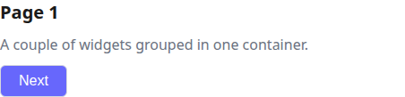

### Alerts: success, info, warning, error

```python
self.success("This is a success message.")
self.info("This is an info message.")
self.warning("This is a warning message.")
self.error("This is an error message.")
```

Four colored status banners — call any of them straight from a callback
(`if saved: self.success("Saved!")`), not just in `build()`.

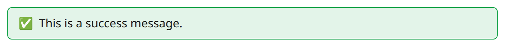
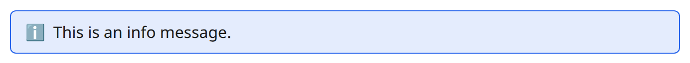
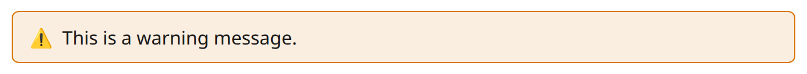
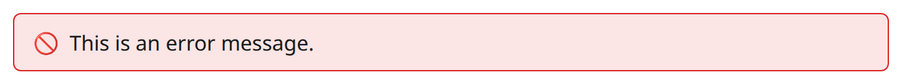

### Badge

```python
self.badge("New")
self.badge("Beta", color="info")
self.badge("Active", icon="✅", color="success")
self.badge("Deprecated", color="warning")
self.badge("Failed", icon="🚫", color="error")
```

A small pill-shaped status/tag label, Streamlit `st.badge` style. `color`
is one of `"success"`, `"info"`, `"warning"`, `"error"` (the same
semantic colors as the alert banners above) or `None` for a neutral,
theme-colored badge; `icon` is an optional leading emoji. Unlike the
alert banners, a badge is a small inline-sized element (not a full-width
banner) — a natural fit for a status tag next to a `text()` in a
`columns()` row or a table cell, not a page-level notice.

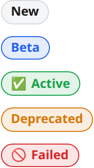

### Toast

```python
self.button("Toast", on_click=lambda: self.toast("Saved!", level="success"))
```

A transient corner notification that dismisses itself after
`duration_ms` (default 4000). `level` is `"info"` (default), `"success"`,
`"warning"`, `"error"`, or `"plain"`.

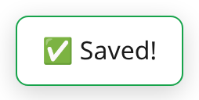

### Layout: columns and sidebar

`columns()` and `sidebar()` return containers that support the same
`.text(...)`/`.button(...)`/... calls as `self`, but append into that
container instead of the main page flow:

```python
class MyApp(KApp):
    def build(self) -> None:
        nav = self.sidebar()
        nav.text("Navigation", bold=True)
        nav.button("Home", on_click=self.go_home)

        left, right = self.columns(2)
        left.text("Left side")
        right.button("Right side", on_click=...)
```

Pass `columns()` a list of numbers instead of a plain count to control
each column's relative width — one column per number, in that order,
each getting that share of the row:

```python
narrow, medium, wide = self.columns([0.1, 0.2, 0.7])   # 10% / 20% / 70%
narrow.text("Sidebar-ish")
wide.text("Main content")
```

The weights must be positive and sum to `1` — `columns()` raises
`ValueError` immediately if they don't, rather than silently rendering a
skewed layout. `columns(2)`/`columns(3)`/... (a plain count) is
unaffected by this and keeps working exactly as before: those columns
split the row equally, with no weight involved at all.

`sidebar()` is a persistent panel pinned to the left edge of the page
(create at most one — a second call gives you a second, overlapping
panel, since kwebui doesn't enforce a singleton). It's collapsible by
default — click the `‹` arrow to collapse it — pass `collapsible=False`
to pin it open and remove the arrow entirely:

```python
nav = self.sidebar(collapsible=False)
```

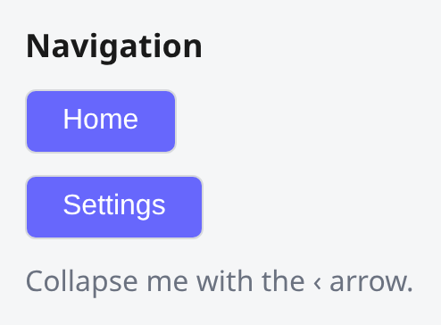

`columns(n)` splits into `n` side-by-side containers that flow with the
rest of the page.

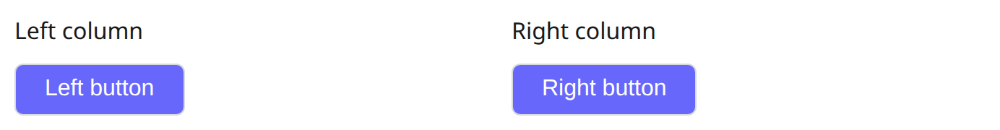

### Popup

```python
self.button(
    "Discard changes?",
    on_click=lambda: self.popup(
        "Discard changes?", kind="yesno", on_return=self.on_discard_answer
    ),
)
```

A modal dialog, built on the browser's native `<dialog>` element (so it
gets a dimmed backdrop and a proper focus trap for free). `kind` picks
the button set: `"ok"` (just OK), `"okcancel"`, `"yesno"`, or
`"yesnocancel"`. `on_return(answer)` is called once, with whichever
button was pressed (`"ok"`, `"cancel"`, `"yes"`, or `"no"`) — the popup
then closes and removes itself, it does not need to be closed manually.
Pressing Escape answers `"cancel"` if Cancel is one of the buttons, and
is otherwise ignored (an OK-only or Yes/No popup can't be dismissed
without an explicit answer).

### WorkflowTracker

```python
tasks = [
    {"id": 1, "title": "Job Search", "status": "completed"},
    {"id": 2, "title": "Submit Application", "status": "error", "detail": "Missing Details"},
    {"id": 3, "title": "Interview Process", "status": "in-progress"},
    {"id": 4, "title": "Hiring Decision", "status": "pending"},
]
self.tracker = self.workflow_tracker(tasks, on_select=lambda task_id: print("clicked", task_id))
```

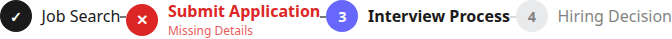

A step tracker/stepper: a circle per task (a checkmark, an X, a step
number, or a muted step number, depending on `status`) connected by a
line, with the task's `title` and optional `detail` subtitle next to it.
`status` is one of `completed`, `in-progress`, `pending`, or `error`.
`orientation` is `"horizontal"` (default) or `"vertical"`.

Update it later from a callback — either replace the whole list, or (the
more common case) advance a single step in place:

```python
self.tracker.set_task_status(2, "completed")             # progress one step
self.tracker.set_task_status(3, "error", detail="Retry")  # ...or flag one as failed
self.tracker.set_tasks(new_tasks)                         # or replace the whole list
```

Clicking a step fires `on_select(task_id)`, if given.

### Topbar

```python
bar = self.topbar()
bar.text("My App", bold=True)
bar.workflow_tracker(tasks)
```

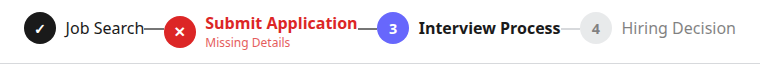

A full-width panel pinned to the top of the page — the header-bar
equivalent of `sidebar()`, and (like `sidebar()`/`columns()`) a generic
container: it accepts the same `.text(...)`/`.button(...)`/... calls as
`self`. Sticky (stays visible while the page scrolls) by default; pass
`self.topbar(sticky=False)` to have it scroll away with the rest of the
page instead. Create at most one, as the first thing in `build()`, so it
actually ends up at the top — same singleton caveat as `sidebar()`. Works
alongside a `sidebar()`: the topbar automatically starts to the right of
it rather than covering it, and shrinks or grows as the sidebar is
collapsed or expanded.

## 5. Highlighting a widget

Any widget — not just a specific type — can be wrapped in an
attention-grabbing outline, e.g. to flag a validation error or draw the
eye to whatever just changed:

```python
self.name = self.textedit("Name", placeholder="Jane Doe")

self.name.highlight()          # outline in the theme's default highlight color (red)
self.name.highlight("#16a34a") # outline in a specific color, this widget only
self.name.unhighlight()        # remove it
```

`highlighted` (bool) and `highlight_color` (str, only set for a per-call
override) are also readable directly on the widget, e.g. to toggle
based on current state:

```python
if self.name.highlighted:
    self.name.unhighlight()
else:
    self.name.highlight()
```

The default color comes from the active theme's `--sg-highlight` CSS
variable (see [Themes](#7-themes) below) rather than being hardcoded, so
switching themes or shipping a custom theme changes it everywhere
without touching any Python code.

## 6. Sending keyboard focus

```python
self.name = self.textedit("Name", placeholder="Jane Doe")
self.button("Focus Name", on_click=lambda: self.name.focus())
```

`.focus()` sends keyboard focus to any widget's underlying input element
(the `<input>`/`<textarea>`/`<select>`/`<button>` inside it) — useful for
e.g. moving focus to the first invalid field after a validation error.
Widgets with nothing focusable (`text`, `image`, ...) simply do nothing.
Unlike `.highlight()`, focus is a one-shot action, not persistent state —
a browser that connects later never "replays" a focus that already
happened.

## 7. Hiding, showing, removing, and disabling a widget

Any widget — not just a specific type — can be hidden and later shown
again, or removed for good:

```python
self.name = self.textedit("Name", placeholder="Jane Doe")

self.button("Hide", on_click=lambda: self.name.hide())
self.button("Show", on_click=lambda: self.name.show())
self.button("Remove", on_click=lambda: self.name.remove())
```

`.hide()`/`.show()` toggle visibility — the widget stays in the page
tree and keeps whatever state it had (a `textedit`'s typed value, a
`checkbox`'s checked state, ...), it's just not rendered while hidden.
Like `.highlight()`, this is persistent state: a browser that connects
*after* you called `.hide()` still sees the widget hidden, since it's
part of what gets sent on `init`. `widget.visible` (bool) is also
readable directly, e.g. to toggle based on current state:

```python
if self.name.visible:
    self.name.hide()
else:
    self.name.show()
```

`.remove()` is permanent — it drops the widget from the server-side page
tree entirely and tells every connected browser to remove it, rather
than just hiding it. There is no corresponding "un-remove"; call
`.hide()` instead if you might want the widget back later.

```python
self.button("Disable", on_click=lambda: self.name.disable())
self.button("Enable", on_click=lambda: self.name.enable())
```

`.disable()`/`.enable()` work the same way, on any widget, for
*interactivity* rather than visibility: a disabled widget stays visible
but stops responding — a click, keystroke, selection, or shortkey
addressed to it is dropped before it ever reaches your callback, exactly
as if the browser had sent nothing at all. It's dimmed and shows a
"not-allowed" cursor generically; `button`/`checkbox`/`textedit`/
`slider`/`listbox`/`file_uploader` additionally get their native
control's own `disabled` attribute, so a disabled text field or dropdown
can't be typed into or operated by keyboard either, not just clicked.
`widget.enabled` (bool) is readable directly, same as `visible` above.
`button` also keeps its original `enabled=True` constructor kwarg and
`.set_enabled(bool)` method as convenience aliases for the same
mechanism — `self.button("Save", enabled=False)` and
`self.name.disable()` end up in the same state.

## 8. Themes

```python
self.set_theme("dark")   # or "light" (the default)
```

Themes are plain CSS files. The two bundled ones live in `kwebui/themes/`
inside the package — add a third bundled theme by dropping a
`themes/<name>.css` file there that defines the same `--sg-*` custom
properties as `light.css`/`dark.css`, no widget code changes needed.

```python
self.set_theme("path/to/your_theme.css")   # anywhere in your own project
```

`set_theme()` also accepts a path to a CSS file that isn't bundled with
kwebui at all — anywhere on disk, absolute or relative to the current
working directory. This is how to ship a custom theme as part of your
*own* project instead of needing to modify the installed kwebui package.
The theme's name becomes that file's own stem, sanitized
(`brand_theme.css` → `"brand_theme"`); pass that derived name again
later (instead of the path) to switch back to it:

```python
class MyApp(KApp):
    def build(self) -> None:
        self.set_theme("assets/brand_theme.css")   # active from the very first page load
        ...
        self.button("Reset theme", on_click=lambda: self.set_theme("brand_theme"))
```

Calling `set_theme()` inside `build()` (as above) sets the theme that's
already active on the very first page load — `build()` runs before any
browser has connected, and the initial HTML reads whatever `self.theme`
is by the time it finishes. Calling it later, e.g. from a button's
`on_click`, switches every *already-connected* browser's stylesheet
immediately, no page reload. Either way the file is read fresh from disk
on each request, not cached at `set_theme()` time, so editing the file
and calling `set_theme()` again (even with the same path) picks up the
change. A custom theme file should define the same `--sg-*` variables as
`light.css`/`dark.css` (see below) — kwebui doesn't validate this, so a
variable a theme forgets to define just falls back to the browser's own
initial/inherited value wherever it's used, rather than erroring. See
`examples/custom_theme.py` for a complete runnable example.

Not every `--sg-*` variable is theme-specific (light vs. dark) —
`--sg-button-bg`/`--sg-button-text-color` (`button`'s `color`/
`text_color` defaults) and `--sg-container-padding-vertical`/
`--sg-container-padding-horizontal` (`container`'s padding defaults) are
structural defaults defined once in `base.css`'s own `:root`, shared by
every theme, rather than redefined per theme file. Override them in your
own stylesheet to change the default everywhere, or redefine them inside
a specific `themes/<name>.css` if you want that one theme to have its
own button color or container padding.

## Where to go next

- [`docs/architecture.md`](architecture.md) — how the plugin system,
  rendering pipeline, and session lifecycle fit together, if you want to
  understand *why* the above works the way it does.
- [`docs/class-diagram.md`](class-diagram.md) — a Mermaid class diagram
  of the core framework and every built-in widget plugin.
- `examples/` in the repo — `demo.py` (minimal), `showcase.py` (every
  built-in widget on one page), `workflow.py` (a `topbar`'s
  `workflow_tracker` driving which page a `container()` shows),
  `custom_theme.py` (a theme CSS file shipped from your own project),
  `mjpeg_demo.py` and `daheng_demo.py` (camera-feed widgets in practice).
